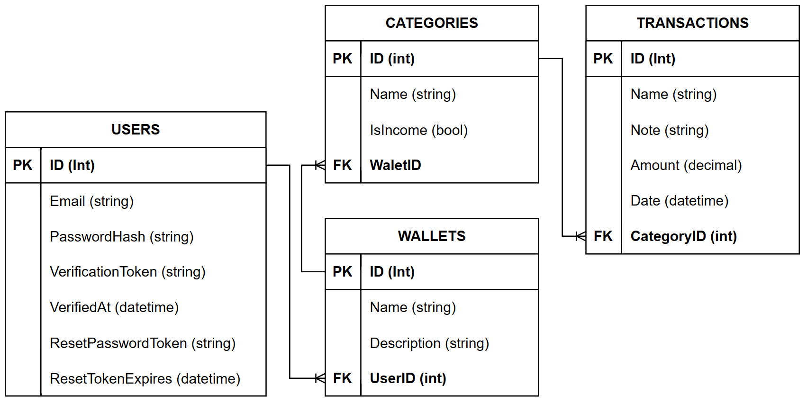

# Personal Finance Management

A comprehensive application for managing personal finances.

The application enables users to manage their incomes and expenses. It allows users to create, edit and delete transactions and categories, categorize transactions and transfer transactions between categories. Each user can create up to 5 independent wallets to track their finances.

By implementing user authentication, the application ensures secure access to data. JSON Web Tokens (JWT) are used to maintain sessions within the system.

### DB Diagram

### Screenshots

Login page with user notification of errors

Dashboard with transaction creation

Dashboard

Wallets and categories

Delete a category dialog

Transactions

